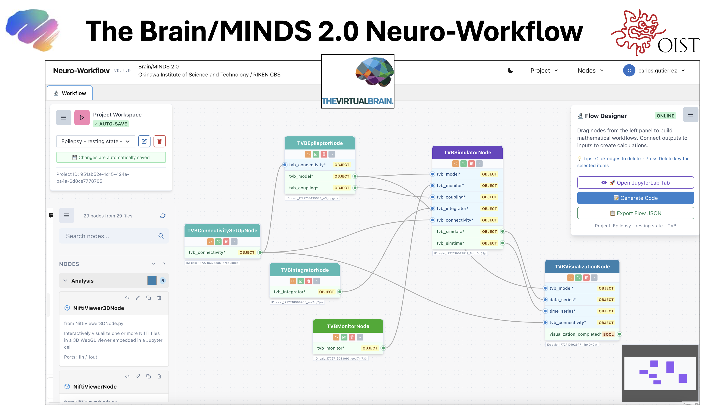

# Neuro-Workflow

**A Python framework for building and executing computational neuroscience workflows through a unified node-based architecture.**

---

## Why Neuro-Workflow?

Modern brain modeling workflows require complex sequences of data processing, model configuration, and analysis steps. While powerful tools exist, they typically focus on single simulation environments and demand advanced programming knowledge — limiting accessibility, reproducibility, and collaboration.

Neuro-Workflow addresses this through a **node-based graph framework** that transforms complex scientific workflows into modular, reusable, and interpretable components:

- **Simulator interoperability** — TVB, NEST, and custom solvers run as interchangeable nodes through a unified interface
- **AI-ready infrastructure** — each node contains structured metadata and semantic descriptions enabling accurate workflow composition by LLM agents via protocols such as MCP
- **Accessibility** — researchers without extensive programming backgrounds, as well as AI agents, can assemble, reuse, and extend brain models
- **Reproducibility** — workflows are serializable graphs that make pipelines shareable and executable across environments
- **Extensibility** — any Python function can be wrapped as a node; new simulators and tools can be integrated without changing the core

> *"Well-documented nodes, enabled by our schema system, establish the foundation for organizing computational neuroscience functions, algorithms and tools, ready for AI few-shot learning."*

---

## Support and Development

This project is supported by the **<a href="https://brainminds.jp/" target="_blank">Brain/MINDS 2.0</a>** initiative and is being developed by the **<a href="https://www.oist.jp/research/research-units/ncu" target="_blank">Neural Computation Unit</a>** at the **Okinawa Institute of Science and Technology (OIST)** in collaboration with partners.

---

## Preview

Get a first impression of Neuro-Workflow in action:

  

🎥 **Video demonstrations:**

<a href="https://youtu.be/HvcTYz3RIM8" target="_blank">Basal Ganglia Model of the Macaque on Neuro-Workflow using NEST</a>
 <small>Credits: Carlos Enrique Gutierrez</small>

 

<a href="https://youtu.be/_FAjMHKHhGw" target="_blank">Marmoset Full-Brain Model on Neuro-Workflow using TVB</a>
 <small>Credits: Carlos Enrique Gutierrez and Henrik Skibbe</small>

 

<a href="https://youtu.be/hC4NUOuR3OI?si=VwYyRLDbtXGk6RiF" target="_blank">First View of Neuro-Workflow</a>
 <small>Credits: Carlos Enrique Gutierrez</small>

---

## Current Status

### Neuro-Workflow Python API

Neuro-Workflow provides a comprehensive Python API for building and executing computational neuroscience workflows using a node-based system. The core functionality is organized as follows:

#### Node System

- **Node Storage**: All available nodes are stored in `src/neuroworkflow/nodes/`
- **Organization**: Nodes are organized in customizable categories for easy navigation
- **Extensibility**: New custom nodes can be created and integrated into the system

#### Creating Custom Nodes

For developers interested in extending Neuro-Workflow with custom functionality:

- **📋 Node Schema**: See `NODE_SCHEMA.md` for detailed node structure specifications
- **📝 Template**: Use `CustomNodeTemplate.py` as a starting point for new nodes
- **📖 Tutorial**: Follow `CUSTOM_NODE_TUTORIAL.md` for step-by-step node creation guide

#### Python API Examples

The following examples demonstrate how to use the Neuro-Workflow Python API to create and execute workflows:

**Examples folder:**

- `sonata_simulation.py` - Basic simulation example
- `neuron_optimization.py` - Parameter optimization example (in development)
- `epilepsy_rs.py` - Epileptic resting state simulation using The Virtual Brain (TVB)

**Notebooks folder:**

- `01_Basic_Simulation.ipynb` - Interactive basic simulation tutorial
- `epilepsy_rs.ipynb` - Interactive epileptic resting state example with TVB
- `SNNbuilder_example1.ipynb` - Spiking Neural Network building with SNNbuilder custom nodes

### Neuro-Workflow Web Application

For users who prefer a graphical interface, Neuro-Workflow includes a comprehensive web application that provides visual workflow building capabilities.

#### Installation

To set up the web application, follow the detailed instructions in `gui/README.md`.

#### Important Setup Notes

**Node Synchronization:**

- The web app requires nodes to be copied from `src/neuroworkflow/nodes/` to `gui/workflow_backend/django-project/codes/nodes/`
- This copy is regularly performed by administrators
- **For developers**: If you create new custom nodes, ensure they are copied to the web app directory to make them available in the GUI

**Core API Synchronization:**

- The Python API base code from `src/neuroworkflow/core/` is also copied to the web application
- Web app location: `gui/workflow_backend/django-project/codes/neuroworkflow/core/`
- This ensures the web app stays synchronized with the latest API updates

---

## Conference Presentations

This work has been presented at several conferences and workshops, receiving valuable feedback that has contributed to its ongoing development:

### 2026

- **Unified Theory Workshop** (April 23, 2026)

  - _"NeuroWorkflow: Agent-Assisted Brain Modeling"_
  - [📄 Poster](posters_conferences/poster_unified_theory_20260425.pdf)

### 2025

- **INCF/EBrains Summit**

  - _"NeuroWorkflow: A Node-Based Framework for Scalable Computational Neuroscience with AI-Ready Infrastructure"_
  - [📄 Abstract](posters_conferences/abstract_INCF_EBrains_summit.pdf)
  - [📄 Poster](posters_conferences/EBRAINS-Summit-2025-Poster.pdf)

- **RIKEN CBS Hackathon** (September 28, 2025)

  - _"Building BrainModeling Workflows: A proof-of-concept framework"_
  - [📄 Hackathon Material](posters_conferences/hackathon_material_OIST_carlos_20250928.pdf)

- **CNS 2025 (Computational Neuroscience Society)**

  - _"A Graph-Based, In-Memory Workflow Library for Brain/MINDS 2.0 – The Japan Digital Brain Project"_
  - [📄 Poster](posters_conferences/Poster_cns2025_Carlos.pdf)

- **NEST Conference 2025** (June 17, 2025)

  - _"A Graph-Based, In-Memory Workflow Library for Brain/MINDS 2.0"_
  - [📄 Presentation Slides](posters_conferences/NEST_conference_slides_20250617_Carlos.pdf)

- **Unified Theory Workshop** (May 30, 2025)

  - _"NeuroWorkflow: A python-based Graph Framework for Modular Brain Modeling Workflows"_
  - [📄 Poster](posters_conferences/Unified_Theory_Poster_2025May30.pdf)

- **Winter Workshop**

  - _"Towards a Generic and Open Software for Building Digital Brains"_
  - [📄 Poster](posters_conferences/Winter_WorkShop_BM2.pdf)

---

## Publications

Neuro-Workflow is currently under preparation for publication. If you use it in your research, please check back for the citation or contact us.

### Related Publications

- Gutierrez et al. (2022). *A Spiking Neural Network Builder for Systematic Data-to-Model Workflow.* Frontiers in Neuroinformatics. https://doi.org/10.3389/fninf.2022.855765

- Gutierrez et al. (2025). *Topological basal ganglia model with dopamine-modulated spike-timing-dependent plasticity reproduces reinforcement learning, discriminatory learning, and neuropsychiatric disorders.* bioRxiv. https://doi.org/10.1101/2025.11.10.687760

---

## License

This project is licensed under the GNU Affero General Public License v3.0 or later (AGPL-3.0-or-later) - see the LICENSE file for details.
